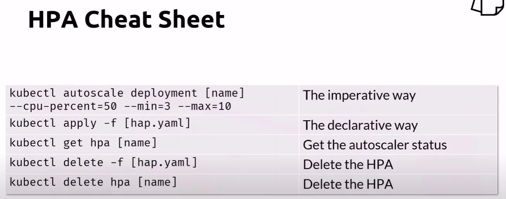

# Kubernetes Pods - Horizontal Pod Auto Scaler

Let's use the Horizontal Pod Autoscaler to scale a pod.

## Metrics Server

Is the Metrics Server installed in your cluster? Look for a pod/deployment called **metrics-server** in the kube-system namespace

    kubectl get all -n kube-system | grep "metrics-server"

If not, install the Metrics Server

    kubectl apply -f components.yaml

The YAML file was downloaded from the Metrics Server Git repo located here:

    https://github.com/kubernetes-sigs/metrics-server/releases

The file was edited to include an extra parameter in the args section of the Deployment

    - --kubelet-insecure-tls

## Create the deployment

    kubectl apply -f deploy.yaml

    kubectl get pods

## Set the autoscaling limits

    kubectl autoscale deployment hpa-deployment --cpu-percent=50 --min=1 --max=4

Validate

    kubectl get hpa

## Deploy Busybox

    kubectl apply -f pod.yaml

## Connect to the BusyBox container

    kubectl exec mybox -it -- sh

## Increase load

Type this endless loop:

    while true; do wget -q -O- http://horizontal-pod-scaler-service; done

Validate

    kubectl get hpa

## Launch K9s

In a separate terminal, launch K9s and see what’s happening.

## Stop the endless loop

Press **Ctrl-C** to terminate the loop and type **exit** to terminate the busybox.

## Delete the autoscaler

    kubectl delete hpa hpa-deployment

## Cleanup

    kubectl delete -f pod.yaml --grace-period=0 --force
    kubectl delete -f deploy.yaml

Optionally, delete the Metrics Server

    kubectl delete -f components.yaml

# Horizontal Pod Autoscaler Cheatsheet

