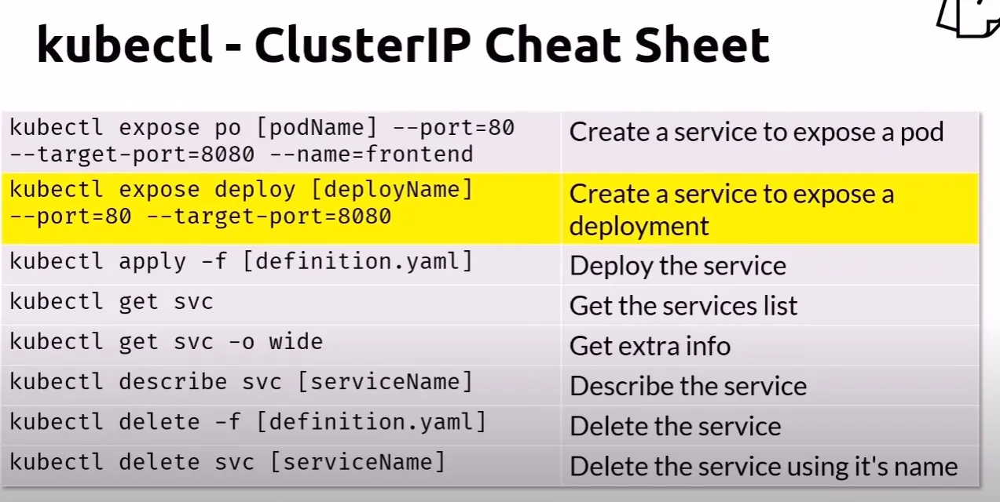

# Kubernetes Services - ClusterIP

## Deploy the service

    # Deploy Service
    kubectl apply -f clusterip.yaml

    # Deploy App
    kubectl apply -f deploy-app.yaml

    # Deploy Busy Box
    kubectl apply -f pod.yaml

    # Single Line Command to Deploy everything at once
    kubectl apply -f clusterip.yaml -f deploy-app.yaml -f pod.yaml

## Get the pods list

    kubectl get pods -o wide

## Connect to the BusyBox container

    kubectl exec mybox -it -- sh

## Get the Nginx home page thru the ClusterIP service

    # This domain name is created by the Service Name:{Port} specified in clusterip.yaml.
    # Note that the reason it is serving the NGINX container is because of the Selector we applied to the Service. It matches the pod with label
    #   "app: app-example + env: prod".
    wget -qO- http://svc-clusterip-example:8080
    exit

## Cleanup

    kubectl delete -f clusterip.yaml
    kubectl delete -f deploy-app.yaml
    kubectl delete -f pod.yaml --grace-period=0 --force

Or delete all files in a single line as follows:

    kubectl delete -f clusterip.yaml -f deploy-app.yaml -f pod.yaml --grace-period=0 --force

## ClusterIP Cheatsheet

