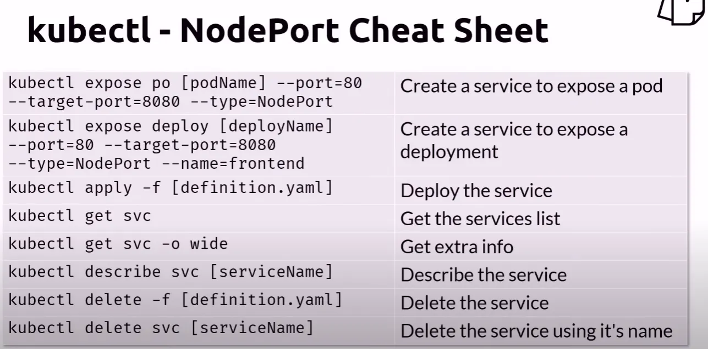

# Kubernetes Services - NodePort

Let's expose a deployment using a Nodeport service.

## Deploy Files

    # Deploy App
    kubectl apply -f deploy-app.yaml

    # Deploy the NodePort Service
    kubectl apply -f nodeport.yaml

    # One Line shorthand
    kubectl apply -f deploy-app.yaml -f nodeport.yaml

## Get the pods list

    kubectl get pods -o wide

## Use the nodeport

Since we are using Docker Desktop and that the Docker Desktop node is mapped to localhost, to reach the service you need to use **localhost** + the **nodeport**.
For this example, to access localhost, will use http://localhost:32410/

When using a Cloud provider, you would need to get a node IP address instead of localhost.

Get the node public IP address

    kubectl get nodes -o wide

Then you would do http(s)://{Node-ExternalIP}:{NodePort}

## Cleanup

    kubectl delete -f nodeport.yaml
    kubectl delete -f deploy-app.yaml

    # Shorthand
    kubectl delete -f nodeport.yaml -f deploy-app.yaml

## NodePort Cheatsheet

