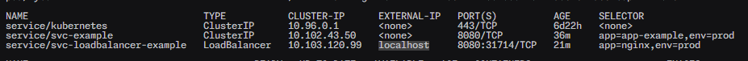

# Kubernetes Services - Load Balancer

Let's expose a deployment using a Load Balancer service, locally using Docker Desktop.

## Deploy the app

    # Deploy App
    kubectl apply -f deploy-app.yaml

    # Deploy Load Balancer Service
    kubectl apply -f loadbalancer.yaml

    # Shorthand
    kubectl apply -f deploy-app.yaml -f loadbalancer.yaml

## Deploy the Load Balancer service

    kubectl apply -f loadbalancer.yaml

## Get the pods list

    kubectl get pods -o wide

## Use the Load Balancer

Since we are using Docker Desktop and that the Docker Desktop node is mapped to localhost, to reach the service you need to use **localhost**.

When using a Cloud provider, you would need to get a Load Balancer external IP address instead of localhost.

Get the load balancer public IP address. This will output **localhost** on Docker Desktop.

    kubectl get svc -o wide

As stated, for our service `svc-loadbalancer-example` for EXTERNAL-IP column, ** localhost ** is stated

For now, go to http://localhost:8080 and it should show the NGINX page.

## Cleanup

    kubectl delete -f loadbalancer.yaml
    kubectl delete -f deploy-app.yaml
