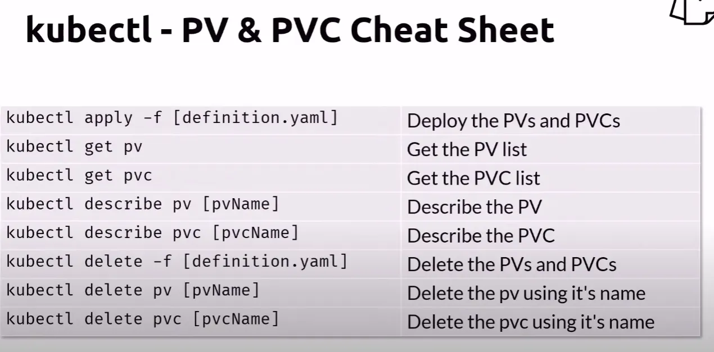

# Kubernetes Storage - Persistent Volumes

## Create Volumes and Deploy Pod

    # Create the Persistent Volume
    kubectl apply -f pv.yaml

    # Look at the pv
    kubectl get pv

    # Deploy the claim
    kubectl apply -f pvc.yaml

    # Look at the pvc
    kubectl get pvc

    # Deploy the pod
    kubectl apply -f pod.yaml

Shorthand to quickly apply above commands.

    kubectl apply -f pv.yaml -f pvc.yaml -f pod.yaml

    # Get Overview of resources in "default" Namespace
    kubectl get all,pv,pvc,nodes -n default -o wide

## Look at the pv

    kubectl get pv

## Deploy the claim

    kubectl apply -f pvc.yaml

## Look at the pvc

    kubectl get pvc

## Deploy the pod

    kubectl apply -f pod.yaml

## Connect to the Busybox instance

    kubectl exec mybox-volume-pvc-ex -it -- sh

## Create a file

    cd demo
    cat > hello.txt
    Hello World
    Enter and Ctrl-D
    ls
    exit

## Delete the pod

Let's delete the pod and deploy it again to validate that the file persisted.

    kubectl delete -f pod.yaml --force --grace-period=0

## Deploy the pod again

    kubectl apply -f pod.yaml

## Connect to the Busybox instance

    kubectl exec mybox -it -- /bin/sh
    cd demo
    ls
    cat hello.txt
    exit

## Cleanup

    kubectl delete -f pod.yaml  --force --grace-period=0
    kubectl delete -f pvc.yaml
    kubectl delete -f pv.yaml

    # Shorthand
    kubectl delete -f pod.yaml --force --grace-period=0 -f pvc.yaml -f pv.yaml

## Persistent Volume and Persistent Volume Claims Cheatsheet

