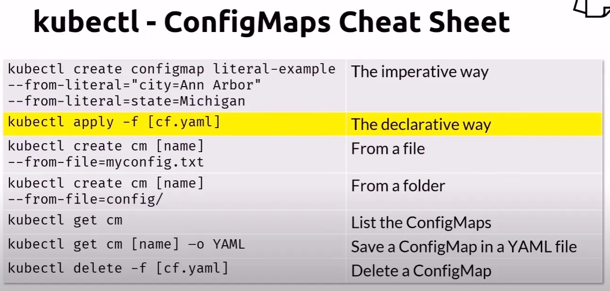

# Kubernetes - ConfigMaps

## Create the ConfigMap

    kubectl apply -f cm.yaml -f pod.yaml

## Get the ConfigMap info

    kubectl get cm
    kubectl describe configmap cm-example

Let's output the same information in YAML format

    kubectl get configmap cm-example -o YAML

## Connect to the Busybox

    kubectl exec mybox -it -- sh

## Display the CITY env variable

    # First see all the Env Variables within BusyBox Image
    env
    # Print out city env variable.
    echo $DB_HOST
    exit

## Cleanup

    kubectl delete -f cm.yaml -f pod.yaml --grace-period=0 --force

## ConfigMap Cheatsheet

