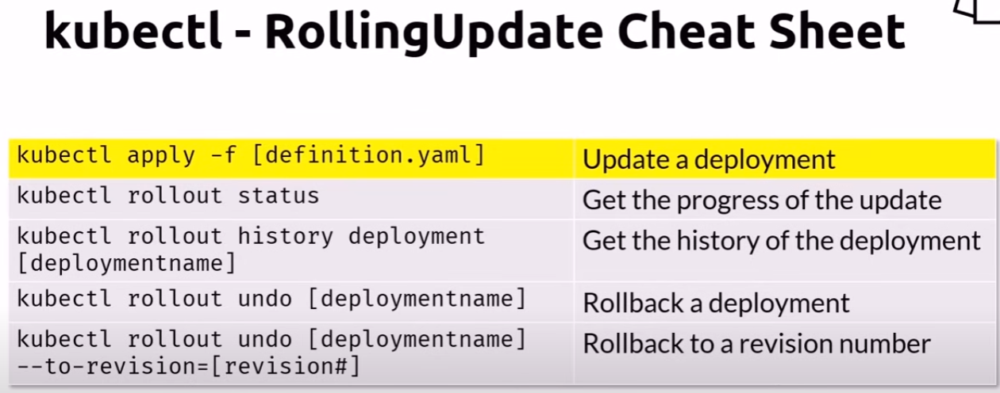

# Kubernetes - Deployments - Strategy = RollingUpdate

**NOTE: If you are running this lab on a ARM64 laptop/PC, edit the YAML file and change the image name from "hello-app" to "hello-arm" keeping the tag name as is.**

## Create a V1 Deployment

    kubectl create -f hello-deployment.yaml

## Get the deployment status

    kubectl rollout status deployment/hello-dep

## Describe the Deployment

    kubectl describe deploy hello-dep

You can see the Strategy Type for Deployment here. It is set to Rolling Update.

## Get the pods list

    kubectl get pods -o wide

## Describe the pod

    kubectl describe pod hello-dep

## How many ReplicaSets do we have?

    kubectl get rs

Do not delete the Deployment yet!

---

## Create a V2 Deployment

Edit the YAML file and change the container version from 1.0 to 2.0. Save the file.

## Create the Deployment

    kubectl apply -f hello-deployment.yaml

## Get the deployment status

    kubectl rollout status deployment/hello-dep

## Get the pods list

    kubectl get pods -o wide

## How many ReplicaSets do we have?

    kubectl get rs

## Get the deployment history

    kubectl rollout status deployment/hello-dep

---

## Rollback

## Undo the last deployment using either

    kubectl rollout undo deployment/hello-dep

or

    kubectl rollout undo deployment/hello-dep --to-revision 1

## Get the deployment history

    kubectl rollout status deployment/hello-dep

## How many ReplicaSets do we have?

    kubectl get rs

## Cleanup

    kubectl delete -f hello-deployment.yaml

## Deployments Cheatsheet

### RollingUpdate Cheatsheet

