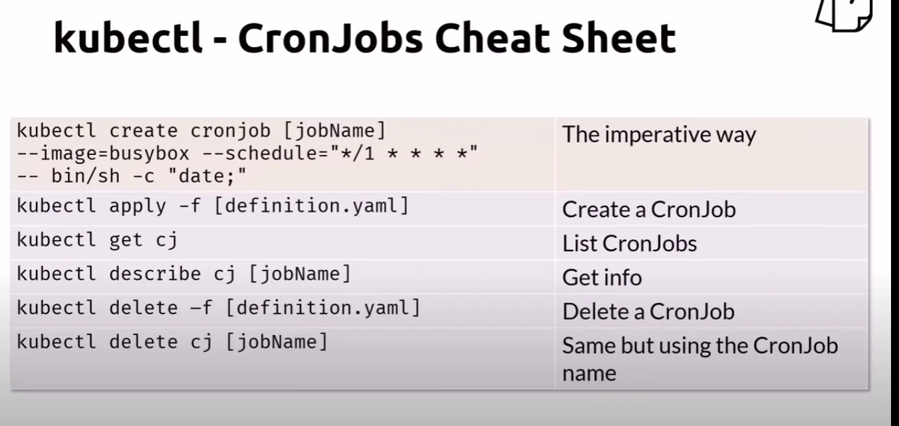

# Kubernetes - Cron Job

Let's now use the CronJob template.

## Explanation of Each CronJob

`hello-cron`: This CronJob runs every minute and executes the command to echo "Hello from the CronJob." It's a simple example for testing purposes.

`daily-backup`: This CronJob is set to run once a day at midnight (00:00). It executes a backup script to back up data or resources, which is a common requirement for maintaining data integrity.

`weekly-cleanup`: This CronJob runs every Sunday at 3:00 AM. It executes a cleanup script to remove old or unused resources, helping to maintain the system's efficiency and free up space.

These examples provide practical use cases that can be easily tested within a Kubernetes environment.

## Create the Job

    kubectl apply -f cronjob.yaml

## Get the jobs list

    kubectl get cronjobs
    # Shorthand
    kubectl get cj

## Get more info

    kubectl describe cronjob
    # Shorthand
    kubectl describe cj

A CronJob Automatically creates and Keeps the last 3 successful Jobs and last Failed Job. You can see this with the `Successful Job History Limit: 3` and `Failed Job History Limit: 1` fields that are there by default if they are omitted in the CronJob YAML File.

## Get the Jobs and Pod name

Note that a CronJob automatically creates jobs, at the scheduled time specified in the YAML `spec.schedule` field. Get the pod's log. Something starting with **hello-**

    kubectl get jobs
    kubectl get pods

It is important to note that the pods will keep changing whenever the schedule runs as it only keeps the last 3 pods + 1 failed pod. Because of this both the Jobs and Pods will keep changing when you do above commands to get a list as it will only show the latest 3. Kubernetes automatically takes care of deleting and creating the new pods through the jobs that are scheduled and created through the CronJob YAML file.

## Get the jobs list

Get the container's log. You should see **Hello from the Job**.

    kubectl logs <podName>

## Cleanup

    kubectl delete -f cronjob.yaml

## CronJob Cheatsheet

